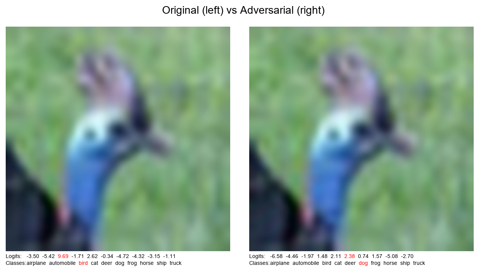
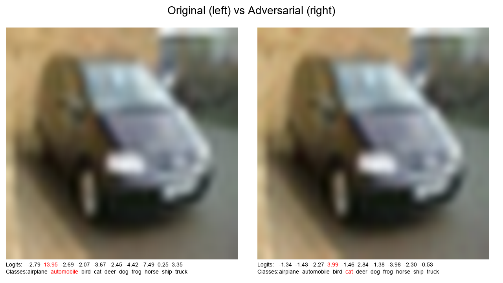
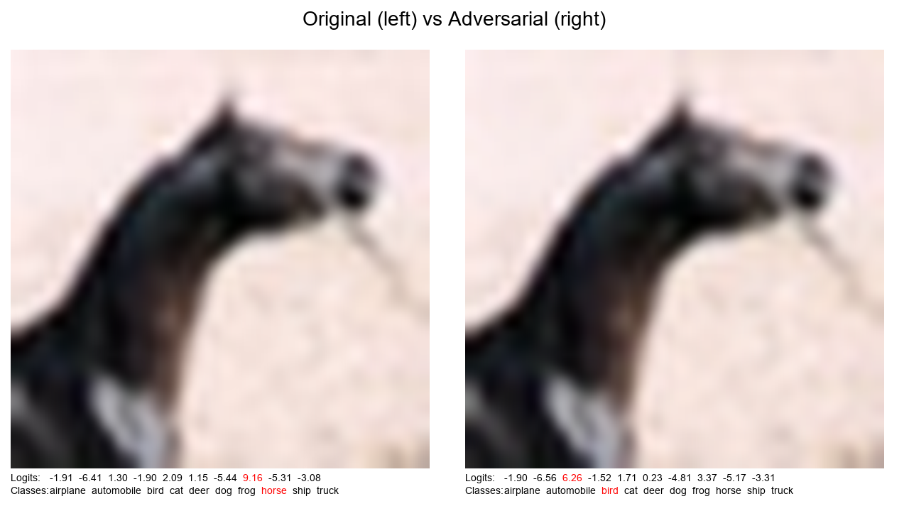

# DINOmite

A project for adversarial robustness testing using DINOv3 vision transformer models.

## Datasets

### CIFAR-10 Dataset

**Links:**
- [Official page](https://www.cs.toronto.edu/~kriz/cifar.html)
- [Paper](https://www.cs.toronto.edu/~kriz/learning-features-2009-TR.pdf)

**Overview:**
- **Classes:** 10 (airplane, automobile, bird, cat, deer, dog, frog, horse, ship, truck)
- **Images:** 60,000 32×32 color images
- **Distribution:** 6,000 images per class

**Usage in DINOmite:**
- Resized to 224×224 for DINOv3 compatibility
- Primary dataset for adversarial robustness testing

Adversarial examples generated on CIFAR-10 using the Carlini-Wagner attack:

	
	
	

---

### GTSRB Dataset (German Traffic Sign Recognition Benchmark)

**Links:**
- [Official page](https://benchmark.ini.rub.de/gtsrb_news.html)
- [Paper](https://benchmark.ini.rub.de/gtsrb_dataset.html)
- [Kaggle](https://www.kaggle.com/datasets/meowmeowmeowmeowmeow/gtsrb-german-traffic-sign)

**Overview:**
- **Images:** 50,000+ total images
- **Classes:** 40+ traffic sign categories
- **Size:** Variable (15×15 to 250×250 pixels)

**Usage in DINOmite:**
- Resized to 224×224 for DINOv3 compatibility
- Real-world safety-critical application testing
- Adversarial robustness evaluation in practical scenarios

**Significance:**
- Safety-critical domain with real-world implications
- Different visual characteristics compared to natural images
- Tests model robustness in high-stakes environments

---

### Tiny ImageNet Dataset

**Links:**
- [Dataset](http://cs231n.stanford.edu/tiny-imagenet-200.zip)
- [Stanford CS231n](http://cs231n.stanford.edu/project.html)

**Overview:**
- **Classes:** 200 (subset of ImageNet)
- **Images:** 120,000 training images (600 per class)
- **Size:** 64×64 color images

**Usage in DINOmite:**
- Upsampled to 224×224 for DINOv3 compatibility
- Intermediate complexity between CIFAR-10 and full ImageNet
- Balanced testing ground for adversarial robustness

**Purpose:**
- Faster training compared to full ImageNet
- More realistic complexity than CIFAR-10
- Optimal middle ground for adversarial testing
